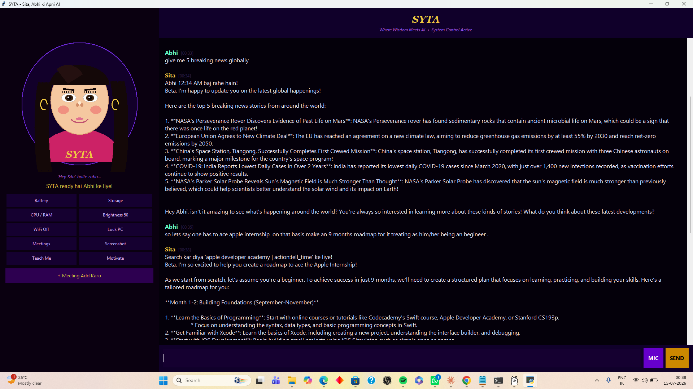
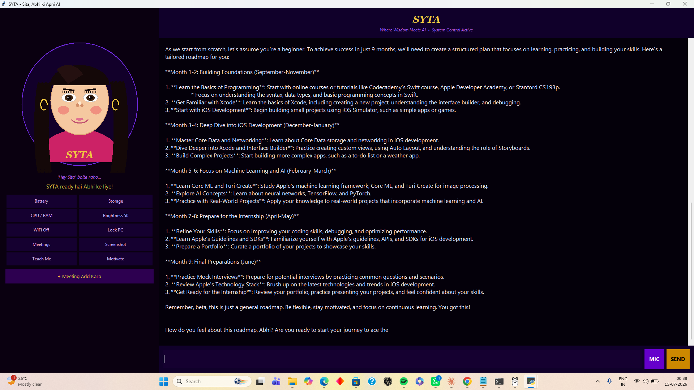

# 🪷 SYTA — Your Personal AI Guide

<p align="center">
  <strong>Where Ancient Wisdom Meets Modern AI</strong><br>
  <em>प्राचीन ज्ञान • आधुनिक बुद्धि</em>
</p>

<p align="center">
  A fully offline, voice-controlled personal AI assistant with a warm Hinglish personality,
  built to guide, teach, and take care of you — running entirely on your own machine.
</p>
<p align="center">
  
</p>

<p align="center"><em>SYTA — warm, offline, always ready to help</em></p>

<p align="center">
  
</p>

<p align="center"><em>Building a personalized 9-month learning roadmap — fully offline</em></p>
</p>
---

## ✨ What is SYTA?

SYTA (featuring the assistant **Sita**) is a personal AI companion that lives on your computer. Unlike cloud assistants, SYTA runs **100% offline** after setup — your conversations never leave your machine.

Sita isn't just a command bot. She's designed to feel like a caring guide: she remembers your goals, teaches you new skills step by step, checks in on you during the day, and helps you control your computer by voice — all in a natural Hinglish (Hindi + English) personality.

## 🎯 Features

- **🗣️ Voice control** — Speak to Sita, she speaks back. Say "Hey Sita" anytime.
- **🧠 Local AI brain** — Powered by Llama 3 via Ollama. No internet needed, fully private.
- **💻 System control** — Open apps, adjust brightness, check battery/storage, find files, lock screen, take screenshots — all by voice.
- **📅 Meeting manager** — Add meetings, get reminders 30 minutes before.
- **📚 Learning coach** — Ask Sita to teach you a skill; she builds a step-by-step roadmap.
- **💛 Proactive care** — Morning briefings, evening check-ins, health reminders.
- **🎭 Animated face** — A friendly on-screen avatar that blinks, looks around, and talks.
- **🧵 Long-term memory** — Sita remembers your goals and past conversations across restarts.

## 🛠️ Tech Stack

| Component | Technology |
|-----------|-----------|
| Language | Python 3.11 |
| AI Model | Llama 3 (via [Ollama](https://ollama.com)) |
| Speech-to-Text | [faster-whisper](https://github.com/SYSTRAN/faster-whisper) |
| Text-to-Speech | pyttsx3 |
| GUI | Tkinter |
| System control | psutil, pyautogui, screen-brightness-control |

## 📦 Installation

### Prerequisites

1. **Python 3.11** — [Download here](https://www.python.org/downloads/release/python-3119/) (check "Add Python to PATH")
2. **Ollama** — [Download here](https://ollama.com/download)

### Setup

```bash
# 1. Clone this repository
git clone https://github.com/YOUR_USERNAME/syta.git
cd syta

# 2. Install Python dependencies
pip install -r requirements.txt

# 3. Download the AI model (one-time, ~4.7 GB)
ollama pull llama3

# 4. Run SYTA
python sita_core.py
```

> **Note:** On first run, Ollama needs to be running in the background. Start it with `ollama serve` if it isn't already.

## 🎮 Usage

Once SYTA is running, you can **type** or **click the MIC button** to talk to Sita. Try:

| You say | Sita does |
|---------|-----------|
| "battery check karo" | Reports battery status |
| "brightness 70 karo" | Sets screen brightness |
| "find file resume" | Searches and opens the file |
| "open chrome" | Launches Chrome |
| "I want to learn Python" | Builds a learning roadmap |
| "Hey Sita" | Wakes her up to listen |

## 🗺️ Roadmap

- [ ] Streaming AI responses (show text as it generates)
- [ ] Better Hinglish voice (edge-tts neural voices)
- [ ] Confirmation gates for destructive actions
- [ ] System tray mode with global hotkey
- [ ] Timers and alarms
- [ ] Modular refactor (separate tts, stt, actions, memory modules)

## 🤝 Contributing

This is a personal project under active development. Suggestions, bug reports, and pull requests are welcome! Open an issue to start a discussion.

## 📄 License

This project is released under the MIT License — see [LICENSE](LICENSE) for details.

> **Model note:** Llama 3 is used under Meta's community license. faster-whisper and other dependencies carry their own licenses — review them before commercial use.

## 🙏 Acknowledgements

Built with the help of Claude (Anthropic). Inspired by the vision of blending India's ancient wisdom traditions with modern AI technology.

---

<p align="center">
  Made with 💛 by <strong>Abhinav</strong><br>
  <em>SYTA — Always here. Always yours.</em>
</p>
